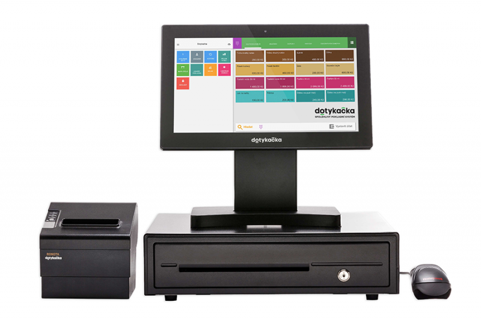
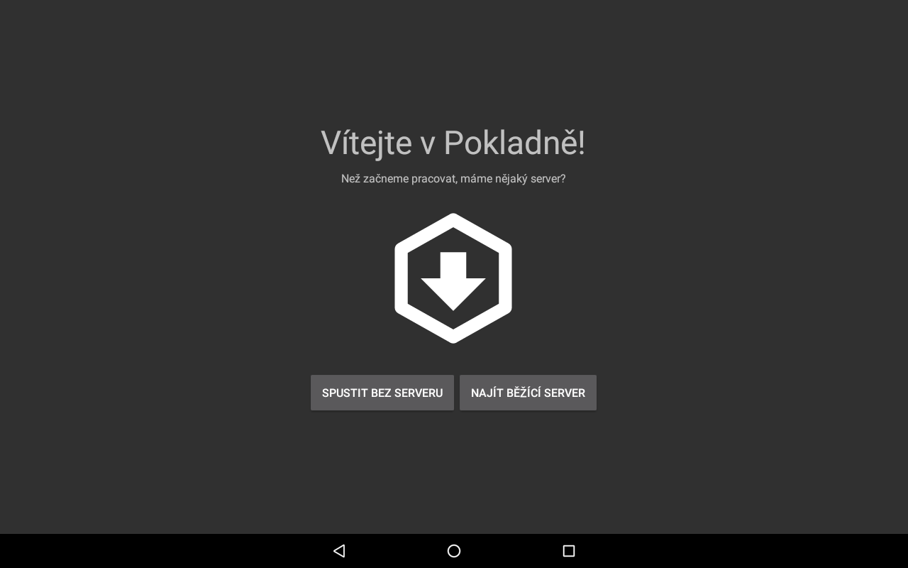
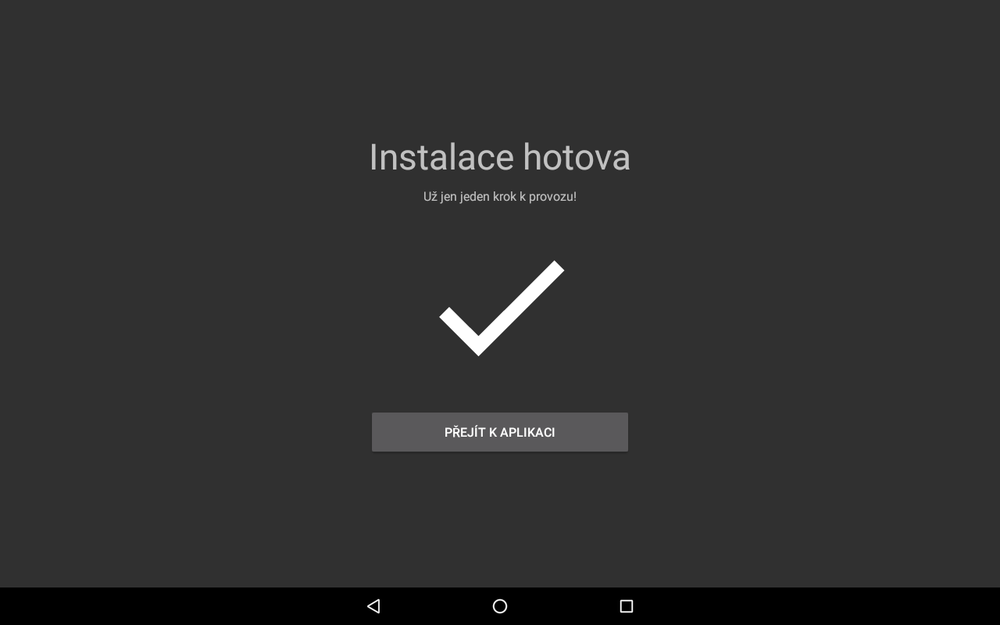
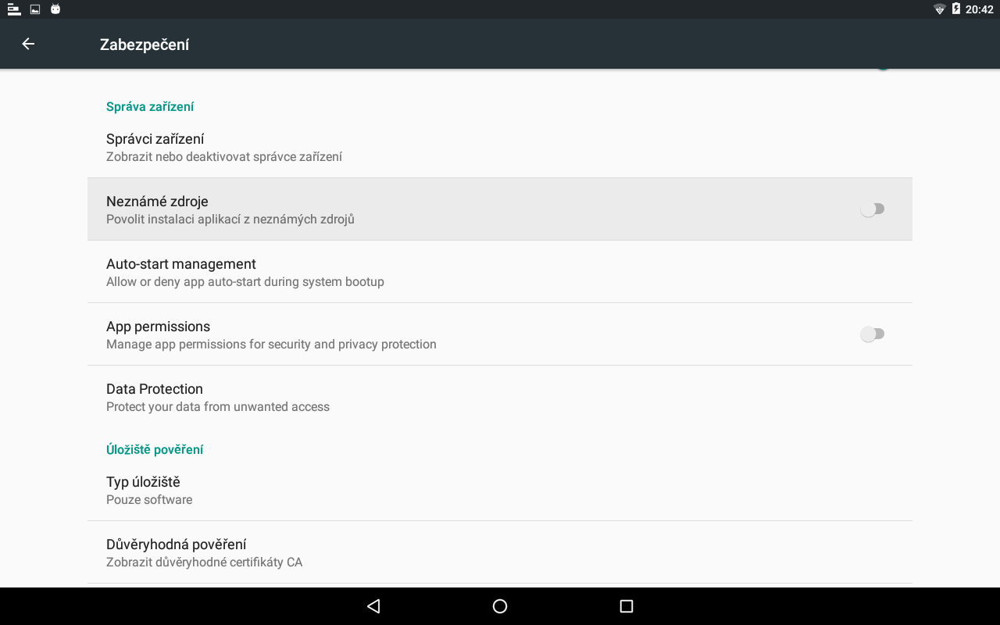
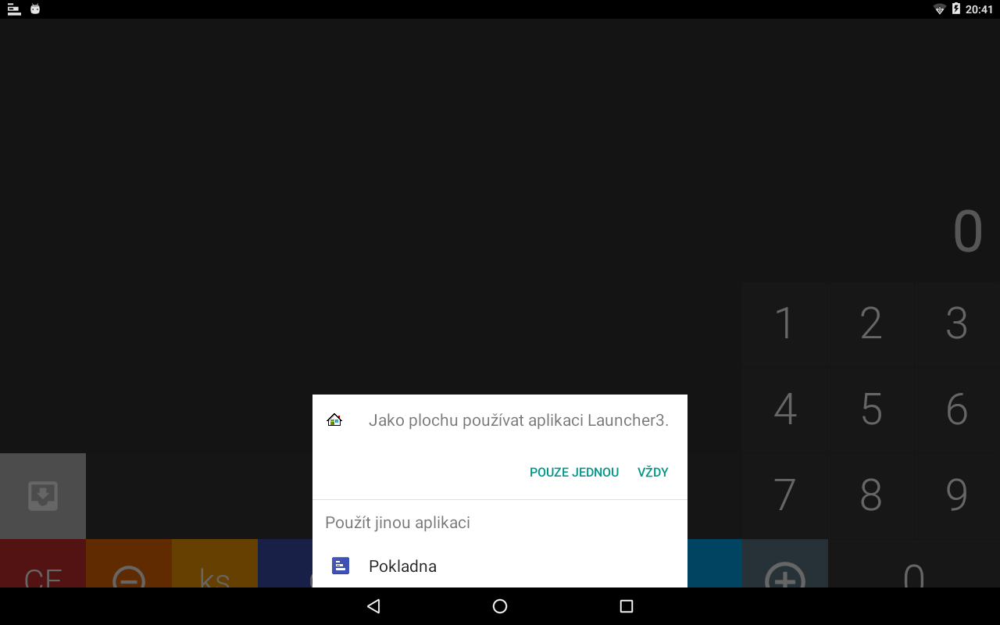
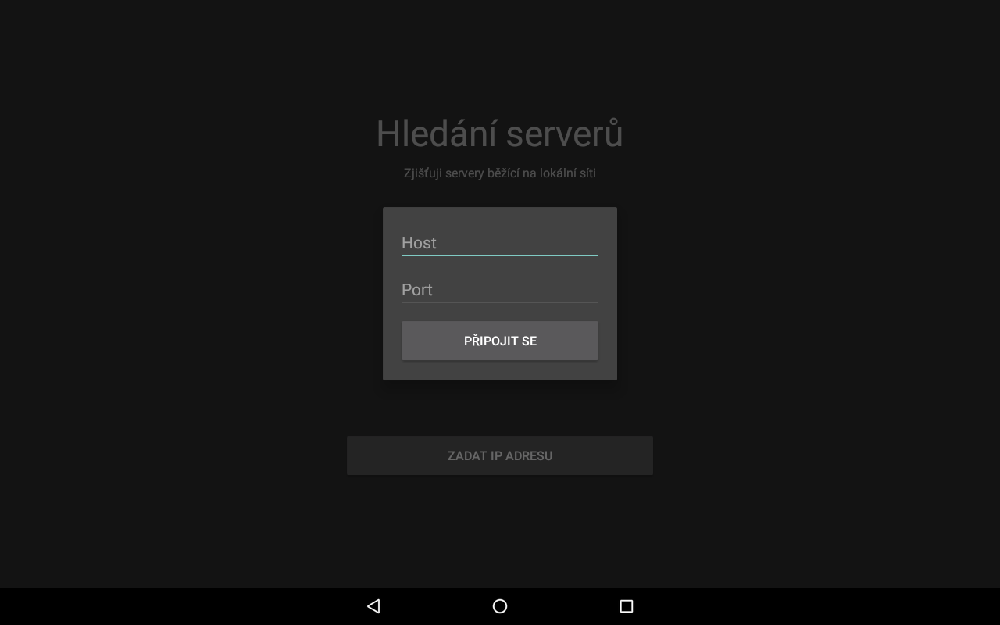
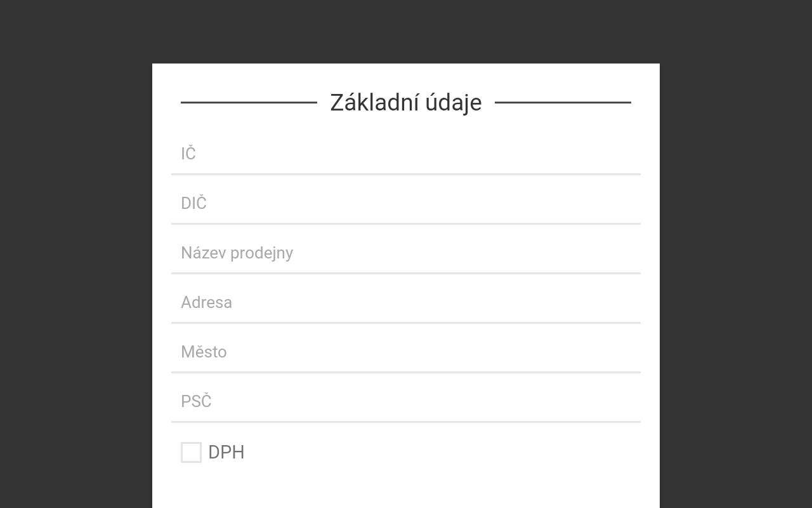
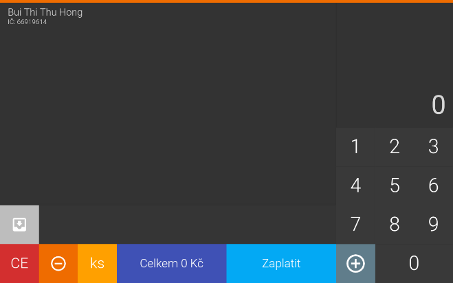
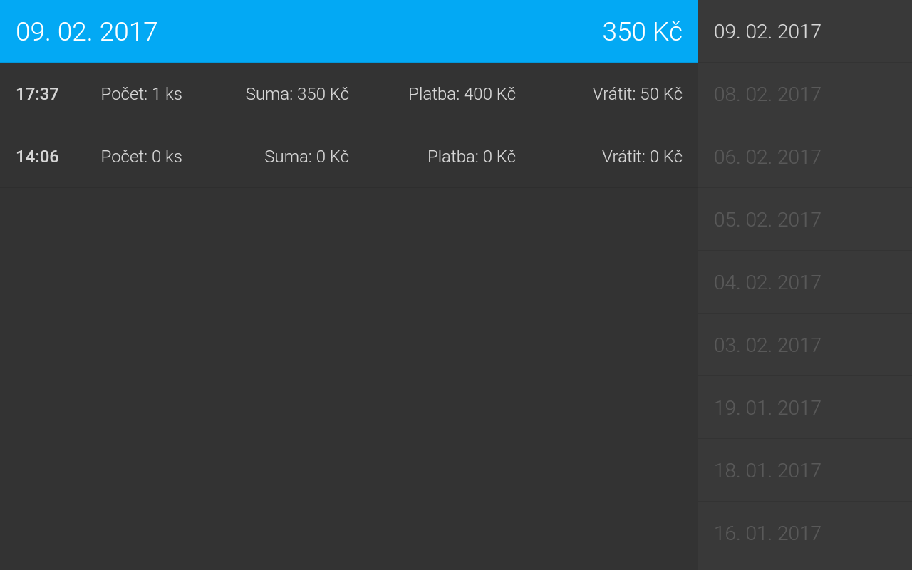

# Úvod
## Motivace
Dnem 13. 04. 2016 (https://www.zakonyprolidi.cz/cs/2016-112) vešel v platnost zákon o elektronické evidenci třžeb, zkráceně EET. Naskytla se tak ojedinělá příležitost pro podnikání, kdy se čista z jasna otevřel lukrativní trh s elektronickými pokladnami. Od začátku bylo jasné, že tento trh může obnášet příjmy v řádech několika miliónů, proto není ani divu, že se této příležitosti chytly velké korporace, jako jsou telekomunikační firmy, které v zásadě si pouze rožšíří svoje existující portfólio internetových služeb. Zároveň se na trhu vyrojilo mnoho startupů, bojující o podíl na trhu s agresivními reklamami a billboardy. Tento zákon se nás obzvlášť týkal, jelikož provozujeme maloobchod s oblečením a používáme staré klasické pokladny, stejně jako většina prodejen před EET. Jelikož jsme chtěli mít rozhraní pokladny plně pod kontrolu, obzvlášt pro vietnamské obchodníky, rozhodli jsme se napsat svoji vlastní aplikaci, která dokáže odesílat účtenku na Finanční správu. 

## Srovnání s konkurenčními řešeními 
Pro srovnání jsme hledali pokladní systémy, které v době psaní této práce na trhu existovaly. Finanční strop jsme si stanovili na 5 000 Kč a jako jediný požadavek jsme měli podporu vietnamštiny. Finanční strop jsme vybrali z důvodu možné daňové úlevy, kdy můžeme uvést veškeré náklady plynoucí z nákupu EET přístrojů do výdajů. Nalezli jsme pouze 2 řešení, které na stránkách uvádějí podporu češtiny: O2 eKasa a Dotykačka. 

O2 eKasa je v tuto chvíli nejprodávanější registrační pokladnou na trhu, s více než 10 000 zákazníky ve dne oficálního spuštění EET (https://www.o2.cz/spolecnost/tiskove-centrum/513034-eKasa_vstoupila_do_ostreho_provozu_EET_v_roli_lidra_trhu.html). Jedná se v základě o balíček Android tabletu s tiskárnou a platebním terminálem a pronajímaným softwarem. Počáteční pořizovací náklady se pohybují od 6 000 Kč s DPH do 20 000 Kč s DPH, v závislosti na příslušenství. Měsíční poplatek za software je stanoven na 500 Kč, kde O2 nabízí nabídku ve formě snížení měsíčního poplatku až na nulu, v závislosti na výši třžby provedené přes jejich platební terminál.


Původně jsme uvažovali právě nad tuto pokladnou, díky její jednoduchosti a možné podpory ze strany O2. Po bližším prozkoumání se však ukázalo, že její náklady na provoz jsou po přepočtu vyšší než u konkurence. Když si propočítáme jejich nabídku snížení měsíčního poplatku, zjistíme, že po přičtení 0.99% procentuální sazby při platbou kartou můžeme platit více než původních 500 Kč. 

Pro srovnání jsme přidali graf výdajů při prostou platbou kartou bez měsíčních poplatků za terminál. Díky vyhláškám Evropské Unie byla stanovena horní hranice procentuální sazby na 0.2% u debetních karet a na 0.3% u kreditních karet. (http://www.mfcr.cz/cs/aktualne/tiskove-zpravy/2015/zmeny-mezibankovnich-poplatku-za-platebn-21456). Pro úplnost jsme také přidali graf simulující procentuální sazbu 0.99%. 

Procentuální sazba je vyjednávána individuálně, tudiž není jednotná a nedá se přesně určit, o kolik platí zákazník více. Můžeme ale s jistotou řici, že si zákazník za provoz O2 připlatí, než kdyby provozoval svoji vlastní pokladnu a platební terminál.

Problémovým se také ukazuje nedostupnost API pro vývojáře, kde vešekrá data tržeb je nahrávána na servery O2 bez možnosti exportu. Poslední kapkou byla cena za montáž, když za poradenství bylo účtováno 1 000 Kč a výš. 

Dotykačka je další z plejády poskytovatelů EET služeb, který má výrazný podíl na trhu (v první fázi EET zakoupilo systém přes 5 000 zákazníků). Oproti O2 eKase nezahrnuje balíček platební terminál a má vlastní API, na který se může napojit vývojář. Stále ale platíme měsíční poplatek v rozmezí od 289 Kč do 590 Kč, v závislosti na počtu funkcí, což nás odradilo od koupi.



# Návod k použití
Pro uživatele nabízíme 3 způsoby, jak tuto aplikaci provozovat. Díky tomu můžeme úspěšně říci, že naše aplikace běží na všech možných myslitelných platformách. Nejedná se o nic převrátného, jelikož v jádru aplikace se skrývá prostá webová aplikace. Byla však navržena tak, aby podávala stejný výkon jako klasická nativní aplikace. Strukturu projektu si rozebereme v další kapitole. Tento návod se bude v jistých částech opakovat, chceme napsat návod, který by chápal i běžný uživatel. 

## Instalace
### 1. způsob: All-in-one 
Z pohledu uživatele nejjednodušší způsob, jak aplikaci nainstalovat. Stačí zapojit veškeré příslušenství a nainstalovat aplikaci na zařízení. Není vyžadováno žádné složité nastavení. Tento způsob je podporován na těchto platformách: Windows, Mac, Linux a Android. Pro iOS zařízení je v tuto chvíli k dispozici pouze 3. způsob, jelikož nemáme k dispozici dostatečně vybavené zařízení pro vývoj iOS aplikací. 

#### Instalace pro Windows, Mac, Linux
Ujistěte se, zda je počítač připojen po celou dobu instalace připojen k internetu; aplikace bude během instalace stahovat dodatečné soubory. Zároveň si připravte přihlašovací údaje, které jste obdrželi při pořízení aplikace.

Stáhneme si instalační soubor z oficiální stránky aplikace: http://pos.duong.cz a dvojitým kliknutím na soubor spustíme instalaci.

Po inicializaci klikneme na tlačítko `Spustit bez serveru`, která připraví aplikaci pro provoz. 



Instalaci aplikace dokončíte kliknutím na `Přejít k aplikaci`. 



#### Instalace pro Android zařízení
Stáhneme aplikaci z oficiálních stránek (http://pos.duong.cz/android) a aplikaci nainstalujeme. Před instalací je nutné povolit instalaci z neznámých zdrojů, v sekci `Nastavení > Zabezpečení > Nezmáné zdroje`. 



Po instalaci a spuštění postupujte dle sekce `Instalace pro Windows, Mac, Linux`. 

Po stiknutí tlačítka `Domů` se systém zeptá na výchozí spouštěč. Doporučujeme si nastavit `Pokladna` jako výchozí spouštěč, aby se zabránilo nechtěnému zavření aplikace. 



### 2. způsob: Rodič a potomek
V případě, že si pořizujeme druhou pokladnu do prodejny, můžeme tyto pokladny navzájem propojit. Všechny údaje o skladě, produktech, tržbách se budou synchronizovat na obou zařízeních. Pro mateřské zařízení platí obdobné minimální požadavky na zařízení: Windows, Mac, Linux a Android. Pro zařízení připojené k matce se tyto požadavky rozšiřují na všechna zařízení s internetovým prohlížečem. 

#### Instalace mateřského zařízení
Obraťtse se na sekci "All-in-one", postupy jsou v tomto případě identické.

#### Instalace klienta
Před instalací se ujistěte, zda mateřské zařízení je zapnuté. Instalaci provedete obdobným způsobem, avšak na uvítací obrazovce klikněte na tlačítko `Mám vlastní server`. Aplikace bude vyhledávat všechny mateřské pokladny na lokální síti, kliknutím na IP adresu se připojíte k zařízení. Můžete také přímo zadat IP adresu serveru. 



Po úspěšném připojení stačí kliknout na tlačítko `Přejít k aplikaci`. 

### 3. způsob: Server a klienti
Pro větší počet pokladen je doporučováno provozovat headless server, na kterém se budou napojovat klientské pokladny. Z technického hlediska se jedná o stejný princip, jako u metody "Rodič a potomek." Budeme se tedy zabývat pouhou instalací serveru, pro instalaci klientských zařízení se obraťte na předchozí kapitolu.

#### Server pro Raspberry Pi
Pro malé a střední podniky jako server doporučujeme Raspberry Pi. S malou spotřebou a malými rozměry se server může vejít úplně všude. Na Raspberry Pi můžete napojit širokou škálu příslušenství, bez ohledu na schopnosti klientských zařízení. Instalace na Raspberry Pi je otázkou jednoho instalačního souboru. Stačí nakopírovat všechny soubory ze složky `utils/` do kořenové složky SD karty operačního systému a vyplnit nastavení v `utils/config.txt`.

Po zapojení RPi do sítě je nutné pro spuštění instalace napsat: 
`sudo /boot/install.sh`

Aplikace se nainstaluje jako služba běžící na pozadí a po instalaci se server automaticky restartuje. Nyní můžete na server napojit jednotlivé klientské zařízení, viz kapitola "Rodič a potomek."

##### Manuální instalace
Před instalací serverové aplikace je nutné nainstalovat a správně nakonfigurovat následující závislosti:

 - python2
 - python-pygame
 - node.js

Instalace serveru je pak dokončena zadáním příkazu do příkazového řádku:

`npm install --production --prefix ./server`

Po instalaci je server nutné spustit příkazem:

`node server`

Na Linuxu lze spouštění po startu docílit instalací `forever` a `forever-service`, který se postará o všechny konfigurační soubory pro automatické spouštění.

```bash
sudo npm install -g forever forever-service
sudo forever-service install nwpos --script ./server/index.js
```

## Návod k použití
Po prvním spuštění se aplikace zeptá na údaje provozovny. Po vyplnění a nahrání se aplikace sama přepne do režimu pokladny.



Základní struktura aplikace:



Kliknutím na ozubené kolečko zobrazíte další možnosti aplikace. Výpisy tržeb si můžete najít kliknutím na `Zobrazit statistiky`.




# Jak to funguje
Celá aplikace byla napsána v JavaScriptu, přesněji ES2016. Díky JavaScriptu můžeme provozovat aplikaci na virtuálně všech platformách, aniž by bylo třeba napsat pro každou platformu nativní variantu. Jedním z požadavků bylo napsat aplikaci, která bude primárně běžet na prohlížeči, proto jsem vynechal velké all-in-one frameworky, které jsou přímo navržené pro tvorbu mobilních aplikací, jako Xamarin nebo Apache Cordova. Tyto frameworky buď vyžadují vlastní runtime pro běh aplikace (C# a CLR) nebo se odkazují na knihovny, které nejsou k dispozici v prohlížeči (Apache Cordova). JavaScript je ideálním (a jediným) jazykem pro psaní webových aplikací. 

# Frontend
Psát aplikace v čistém JavaScriptu se v dlouhodobém horizontu nevyplatí, kód se časem hromadí a jeho správa je s časem čím dál tím více náročnější. Rozhodl jsem se použít nějaký framework, který by usnadnil strukturu projektu a tvorbu UI.

## ECMAScript 2016, Babel a Webpack
ECMAScript 6, dále jen ES6, je nová verze JavaScriptu, následovník verze ECMAScript 5. Přináší do jazyka upravený syntax a nové metody u primitivních typů, polí a objektů. Specifikace ES6 se průběžně mění a implementuje v moderních prohlížečích. Celou specifikaci a jejich stav implementace můžeme najít na stránce http://kangax.github.io. 

Jelikož je podpora ES6 (aspoň v roce 2016-17) stále kolísává, rozhodl jsem se použít Babel. Jedná se o transpiler, který převádí nový syntax ES6 do starších verzí ECMAScriptu pro větší podporu. 

Spolu s Babelem ještě používám Webpack, který usnadňuje kompilaci a vývoj javascriptových aplikací. Tento nástroj můžeme chápat jako MSBUILD pro C# nebo jako Gradle pro Android / Java aplikace. Spolu s ostatními moduly nám Webpack umožňuje live-reload (automatické obnovení při změnách), hot-reload (výměna částí kódů za běhu) a minifikace kódu. 

## Redux
Redux je knihovna, která byla použita pro psaní business logic, čili části kódu, které se nestarají o vykreslení rozhraní. Sama o sobě se jedná o minimální knihovnu, jde spíše o strukturu business logiky. 

Na stránkách můžeme najít, že se jedná o "kontejner stavů." Musíme si nejprve vysvětlit, co vlastně stav aplikace je. Stav aplikace je podoba aplikace se všemi změnami v určitém čase. Zahrnuje, CSS třídy, HTML, ale i globální proměnné apod. V běžné JavaScriptové aplikaci tento "aplikační stav" měníme několika způsoby
	
 - změnou CSS tříd (document.queryElement("a").toggleClass("trida"))
 - změna HTML obsahu: (document.queryElement("p").innerHTML = "obsah"),
 - změnou globálních promněných (window.localStorage.set("vnitřní promněná"))

Z toho důvodu se pak data nepředvídatelně mění na různých místech. Testování takovéto aplikace je složitější a pokryje většinou pouze uživatelské rozhraní. 

Použitím Redux zredukujeme počet zdrojů změn na jeden - na jediný zdroj pravdy. Zdrojem této pravdy je tzv. "kontejner," dále jen "store." Tento zdroj obsahuje všechny data, které aplikace potřebuje pro svůj chod. Data aplikace čte pouze ze store. Data vyjadřují aktuální stav aplikace a stejné data musí uvést aplikaci vždy do stejného stavu. Aplikace se stává předvídatelnou a máme pod kontrolou celý stav a chod aplikace - máme předvídatelný stav ("predicatble state"). 

Díky tomu je ladění aplikace velice jednoduché, všechny zmněy pocházejí pouze z jednoho zdroje, stačí nám pouze ladit samotný zdroj aplikace: store. Také testování je snadné, jelikož můžeme z principu předpokládat, že náš store bude vždy odpovídat stavu aplikace, můžeme testovat i bez prohlížeče. Zároveň můžeme implementovat funkce, které obvykle považujeme za obtížne, jako funkci "Vrátit zpět," ukládání stavu a obnovení stavu aplikace při restartu nebo vykreslení aplikace na serveru.

Abychom se vyvarovali nepředvídatelným změnám v aplikaci, je store v základu pouze read-only. Jediným způsobem, jak změnit náš store, je za pomocí tzv. "akce." Akce je prostý JavaScriptový objekt, který popisující změnu. 

```javascript
let action = (number) => {
	return { type: "set", number: number }
}
```

Samotné změny jsou prováděny pomocí "reducerů." Tyto reducery jsou prosté funkce, které vezmou předchozí stav, aplikují akci a vrátí stav nový. Čekají uvnitř store, než zavoláme `store.dispatch(akce)`, který zavolá náš `reducer.`

```javascript
let initialState = 0 //počáteční stav, při inicializaci
let reducer = function(state = initialState, action) {
	if (action.type === "set") { //pokud máme akci 
		return action.number //vrátíme nový stav
	} 

	//další funkce

	return state // všechny akce provedeny, vrátíme nový stav
}
```
Jednotlivé stavy musí být immutable, tj. nemá žádnou metodu, která je schopna změnit nastavenou hodnotu. Tím tyto stavy jsou na sobě nezávislé a jsou předvídatelné, nazávisí na předchozích stavech. Z principu jsou primitivní typy immutable. Pro pole a objekty musíme používat syntaxi ES6, abychom zajistili tuto vlastnost.

```javascript
//počáteční stav, při inicializaci
let initialState = {
	list: [],
	number: 0
} 

let reducer = function(state = initialState, action) {
	if (action.type === "set") {
		// vytváříme nový objekt a překopírujeme všechny prvky z předchozího stavu + aplikování akcí
		return Object.assign({}, state, { number: action.number })
	} else if (action.type === "add") { //vložení do pole 
		// spread operátor z ES6, vytváříme nové pole
		return Object.assign({}, state, { list: [...state.list, action.number] })
	} 

	return state // všechny akce provedeny, vrátíme nový stav
}
```

Nakonec inicializujeme store pomocí `createStore()`, budeme volat její funkci `dispatch()`, který zavolá všechny reducery s akcí. Změny ve storu můžeme odposlouchávat pomocí `subscribe`, jehož argument se zavolá při každé změně storu. Celý obsah storu získáme voláním funkce `getStore()`.

Zjednodušený příklad užití Reduxu:

```javascript
import redux from "redux"

//počáteční stav, při inicializaci
let initialState = {
	list: [],
	number: 0
} 

let set = (number) => {
	return { type: "set", number: number }
}

let add = (item) => {
	return { type: "add", number: number }
}

let reducer = function(state = initialState, action) {
	if (action.type === "set") {
		// vytváříme nový objekt a překopírujeme všechny prvky z předchozího stavu + aplikování akcí
		return Object.assign({}, state, { number: action.number })
	} else if (action.type === "add") { //vložení do pole 
		// spread operátor z ES6, vytváříme nové pole
		return Object.assign({}, state, { list: [...state.list, action.number] })
	} 

	return state // všechny akce provedeny, vrátíme nový stav
}

let store = redux.createStore(reducer)
store.subscribe(() => {
	console.log(store.getStore()) // Výsledek { list: [1], number: 5 }
})

store.dispatch(add(1))
store.dispatch(set(5))
```

## React
React je knihovna pro vytváření webových komponenent, vyvíjena Facebookem. Spolu s AngularJS se jednají o 2 nejpopularnější frameworky pro vývoj UI. Oproti AngularJS má React plytší křivku učení, nemusíme se učit speciální syntax jako u AngularJS, jedná se o čistý JavaScript. Navíc vzhledem k tomu, že jsme použili pro naši business logiku Redux, která byla pro React přimo vyšitá, dává smysl, abychom použili React pro vývoj rozhraní. React by se dala považovat jako View součást v MVC architektuře, jako je Latte v Nette. 

Klíčovou myšlenkou Reactu je jednosměrnost dat. Místo toho, abychom psali kód, který volá příkazy a vykonává změny, píšeme kód, který pouze vykresluje aktuální stav aplikace. Popisujeme, jak má výsledná stránka na základě příchozích dat vypadat. Jestliže chceme provést nějakou změnu v aplikaci, musíme ji provést příkazem, čili akcí. Je zde vidět jasné podobenství s knihovnou Redux. 

Další z definujících vlastností Reactu je JSX, což je vesměs jen syntaktický cukr usnadňující zápis. Hlavním poznávacím znakem JSX je jeho podobenství s HTML kódem.   

V Reactu se každá aplikace skládá z jednotlivých komponent. Každá komponenta rozšiřuje třídu React.Component a musí implementovat funkci `render()`, který má za úkol vykreslit komponentu. Prakticky jsme úplně odstínění od DOMu a nezávislí na prohlížeči, což nám umožňuje lepší testování a přenositelnost kódu.   

Typický zdrojový kód Reactu může vypadat takto:

```javascript
import React from "react" //musíme nejprve importovat knihovnu React

class Ahoj extens React.Component {
	render() {
		return <div className="hello">Ahoj světe</div>
	}
}

//...

```

Nejedná se o chybu, HTML tagy jsou tady schválně. V Reactu výstup komponent, to jest vykreslení HTML, zapisujeme ve formě "HTML tagů". JSX transpilátor převede tento syntax do klasického JavaScriptu. Nejedná se však o 1:1 klon HTML, JSX má své omezení plynoucí ze specifikace DOM, jako jsou camelCase pojmenování atribut (místo `class` se musí psát `className`) apod.

Výsledek JSX transpilátoru:

```javascript
import React from "react" //musíme nejprve importovat knihovnu React

class Ahoj extends React.Component {
	render() {
		return React.createElement("div", {className: "hello"}, "Ahoj světe")
	}
}

//...
```

Stejně jako v DOMu, React komponenty se dají do sebe skládat. Proto je potřeba, aby měly komponenty mezi sebou způsob předávání dat. V Reactu používáme `props`, se kterým předáváme stav aplikace. 

Mějme nějakou hlavní komponentu, která bude mít vnořené další komponenty:

```javascript
// ...
class Hlavní extends React.Component {
	render() {
		return <div>
			<Ahoj />
			<Jmeno name="David" surname="Duong" />
			<Pocitadlo />
		</div>
	}
}

```

<Ahoj /> je komponenta, kterou jsme si nadefinovali dříve. Jeho výstup bude vždy stejný ("Ahoj světe"). Jak jsme si již všimli, komponenta <Jmeno /> má dodatečné atributy, které dodávají komponentě data. Ty můžeme v komponentu číst z objektu `props`. Jakákoliv změna v `props` vyvolá vykreslení, o to se již postará React sám. 

```javascript
class Jmeno extends React.Component {
	render() {
		return <div>
			<h1>{this.props.name}</h1>
			<h2>{this.props.surname}</h2>
		</div>
	}
}
``` 

Zároveň si můžeme povšimnout, že mezi složenými závorkami můžeme psát JavaScript. Závorku můžeme chápat jako proměnnou, kde výstup závorky se jakoby uloží do hypotetické proměnné.  

```javascript
<div>{true}</div>                // let obsah = true                 ... je OK 
<div>{foo ? true : false}</div>  // let obsah = foo ? true : false   ... je OK
<div>{if (foo) {}}</div>         // let obsah = if (foo) {}          ... nebude fungovat 
```

Nakonec můžeme mezi závorkami psát znova JSX. Často se využívá při vykreslení mnoha prvků, např. za pomocí cyklů.

```javascript
let pole = [1,2,3]

<div>{pole.map(prvek => <span>{prvek}</span>)}</div>  // vytváříme pole divů

// Výsledek je v HTML výstupu ekvivalentní:
// <div>
//     <span>1</span>
//     <span>2</span>
//     <span>3</span>
// </div>
```

Kromě `props` můžeme pro uchování stavu používát i `state`. Ten se obvykle používá u těch stavů, které si spravuje sama komponenta, samotná aplikace jako taková se o tyto stavy zajímat nemusí. Příkladem může být třeba skrytí detailů při kliknutí, nebo zaznamenání počtu kliků. 

Interaktivitu zajišťujeme pomocí inline event atributů jak jsme zvyklí z JavaScriptu, jako je `onClick`, `onSubmit` apod. Tyto eventy jsou stejně jako u vykreslování řízeny a optimalizovány Reactem. Nemusíme se tedy starat s recyklováním callbacků (funkce, které se volají), kdy u klasického JS se vytváří pro každý HTML prvek nový callback. 

Každý callback musíme navázat vlastním objektem pro `this`. Jinak bude `this` odkazovat na DOM objekt, což nám znemnožňuje přístup ke komponentě. 

```javascript
class Pocitadlo extends React.Component {
	constructor(props) {
		super(props)

		//inicializuje state, kdy ještě uživatel neklikl
		this.state = {kliknuti: 0}                                
	}

	kliknul() {
		//pro úpravu stavu musíme vždy volat this.setState(), který vyvolá vykreslení
		this.setState({kliknuti: this.state.kliknuti + 1})       
	}

	render() {
		<span onClick={this.kliknul.bind(this)}>{this.state.kliknuti}</span>
	}
}

```

Propojení s Reduxem je zajištěno knihovnou `react-redux`, která se stará o převádění dat ze store a akcí na `props` pro komponenty. Příklady implementace si můžete prohlédnout ve složce `client/containers`. 

# Backend
Server, čili backend, byl navržen v tomto projektu tak, aby sloužil jako substituent pro nedostupnou funkcionalitu v prohlížeči nebo pro funkce, které se budou pravidelně obměňovat (správa dat, konektivita s EET). Pro EET jsme použili open-source knihovnu `JakubMrozek/eet` a pro databázi jsme použili `louischatriot/nedb`.

## mDNS 
mDNS, neboli multicast DNA, je technologie, která umožňuje najít servery a jejich IP adresy na lokální síti, aniž by na lokální síti běžel plnohodnotný DNS server. Pro provoz není třeba žádná konfigurace ze strany správce sítě. Stačí službu jenom spustit a klienti budou schopni automaticky objevit server a adresu serveru. Tato technologije je známá taky jako Apple Bonjour, nebo Network Service Discovery.

Serverová implementaci mDNS je vyřešena importem knihovny `bonjour`, psána čistě v JavaScriptu. Vyhneme se instalaci Avahi daemonu a kompilaci nativních knihoven. Navíc funguje na všech platformách stejně. Před použitím bylo třeba použít fork `resin-io/bonjour`, který doimplementoval zbytek mDNS specifikace pro objevitelnost na Androidu. 

Pro klientskou Android aplikaci bylo nutné importovat knihovnu `jmdns`, která obsahuje modernější implementaci mDNS oproti zabudovanému Android NSD. Během testování se nativní NSD často zasekával a byl onutné restartovat zařízení pro znovu objezvení služby. 

Pro Android je zde zásadní omezení ve formě IPv6, kde Chrome pro Android stále nepodporuje IPv6 HTTP adresy. Problém nejspíš spočívá v samotném Androidu, který v době psaní této práce stále plně nepdoporuje IPv6. Z toho důvodu jsem zcela vypnul podporu pro IPv6 na úrovni systému, na kterém běží server. Vypnutí je automaticky provedeno při spuštění instalačního skriptu, manuálně lze na Debianu a odvozených operačních systémech IPv6 vypnout vložením tohoto řádku do `/etc/sysctl.conf`

```
net.ipv6.conf.all.disable_ipv6 = 1
```

## ESC/POS tiskárny
Většina termálních tiskáren do pokladen využívá protok ESC/POS, vyvinutý firmou EPSON. Jedná se o sadu příkazů, které se do tiskárny posílají. Veškeré příkazy lze najít v souboru `/server/printer/constants.js`. Všechny příkazy začínají znakem ESC (v ASCII = 27), kromě příkazu pro posun papíru LF (ASCII = 10) a pro seříznutí papíru GS (ASCII = 29). 

Pro podporu češtiny je UTF-8 text překódován do kódování Windows-1250/CP1250, jelikož většina tiskáren UTF-8 přímo nepodporuje. Samotné posílání příkazu je řešeno otevření file descriptoru (FD) tiskárny, čili otevřením a zapisováním souboru reprezentující tiskárnu. Na Linuxu a dalších Unix-based OS se FD otevře ve složce /dev/usb/lp[0-9]. Na Windowsu je nutné nejprve tiskárnu sdílet na síti, posléze je k dispozici na `\\localhost\[název tiskárny]`.

Původně jsem s tiskárnou přímo komunikoval za pomocí knihovny na úrovni ovladačů, přesněji za pomocí libusb ovladačů pro Windows. Tento způsob se nakonec ukázal příliš nespolehlivý a složitý pro koncového uživatele, jelikož pro instalaci musí uživatel restartovat systém do testovacího módu. 

Jako testovací tiskárnu jsem použil ZJ-5890K dovozem z Číny. Tato tiskárna je identická s tiskárnou O2 Kasy, čimž je zaručena kompabalita s tablety O2 kasy. Vesměs jsou podporovány všechny tiskárny, které umí protokol ESC/POS, což je na trhu většina.

## Termux a emulace NodeJS v Androidu
Aplikace byla na začátku koncipována tak, aby se skládala z klientské a serverové části. Tato architektura přináší výhody, které jsme si již zmínili. Dokážeme si ale představit, že instalace a údržba jak klientu, tak serveru by byla časově a v krajních případech i finančně náročná. Bylo by tedy ideální, kdyby šla zabalit funkcionalita serveru do klientské aplikace. Klasickým způsobem integrace by bylo oddělení business logic serveru (databáze, eet) od čistě serverové logiky (http server, mdns), což je dle našeho názoru neefektivní a přináší mnoho problému ve formě výkonu a chyb, které mohou nastat při takovém oddělení. 

Naštěstí na pomoc přichází Termux. Termux je open-source emulátor terminálu pro Android. Spolu s výborným rozhraním terminálu obsahuje aplikace předkompilované Unix balíčky a svůj vlastní systém. Díky této aplikace máme k dispozici většinu Linuxových aplikací, včetně `bash`, `apt-get`, `sed` a hlavně `nodejs`, který potřebujeme pro server. Rozhodli jsme se forknout projekt a integrovat Termux přímo do naší aplikace. 

### Struktura projektu
Nejprve se stáhnou a rozbalí základní systémové balíčky a knihovny, jako je `bash`, `sh` a `busybox` do interní složky aplikace. Tato interní složka je automaticky přiřazována Androidem (viz `Context.getFilesDir()`) na základě `applicationId` v `app/build.gradle`. Bohužel většina binárek hledá závislosti a knihovny nebo přímo ukládá do `/data/data/com.termux`, bez ohledu na `applicationId`. Tento problém se v ideálním případě dá vyřešit rekompilací a provozováním vlastního apt serveru, což je vzhledem k povaze projektu časově a finančně náročné. Proto jsme se rozhodli nastavit `applicationId` na `com.termux`. Po nastavení jsou binárky spustitelné a plně funkční, aniž bychom museli binárky před spouštěním upravovat. Nevýhodou je však nepublikovatelnost na Google Play Store, který vyžaduje pro každou aplikaci unikátní `applicationId`. 

Po rozbalení musíme ještě nastavit všechny symlinky v souboru `SYMLINKS.txt`, aby všechny aplikace vyžadující knihovny fungovaly správně. Celá instalace terminálu se provede voláním `TermuxService.`. 

Po instalaci terminálu můžeme používat balíčky, na které jsme zvykli z klasických linuxových distribucí, jako je například Ubuntu, Debian apod. Inicializace samotného serveru se skládá ze 3 Bash skript, které jsou rozbaleny přímo z APK do kořenové složky terminál, kde jsou spuštěny. Nejprve se spuští `CHECK.sh`, který ověří, zda je server již nainstalovaný. Pokud je server již nainstalovaný, spustí se `RUN.sh`, který spustí server. v opačném případě se spustí `INSTALL.sh`, který nainstaluje všechny závislosti, stáhne a nainstaluje server. 

# Závěr
